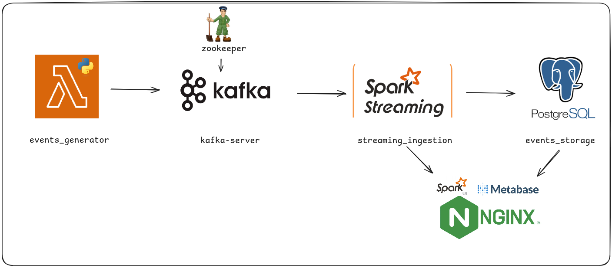
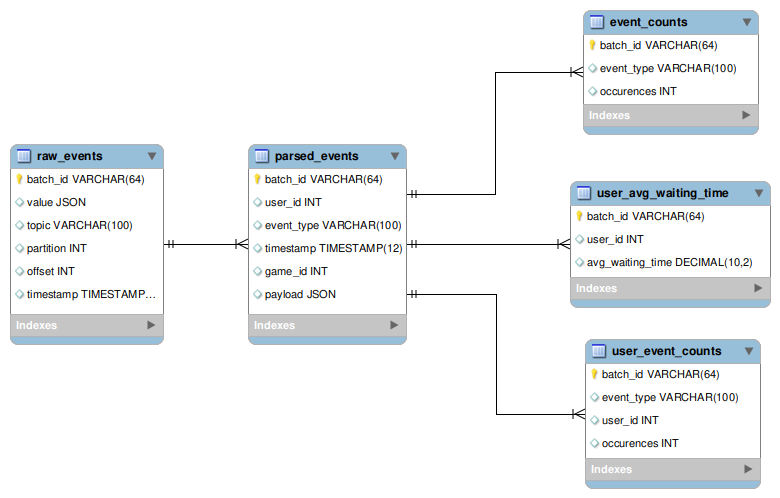
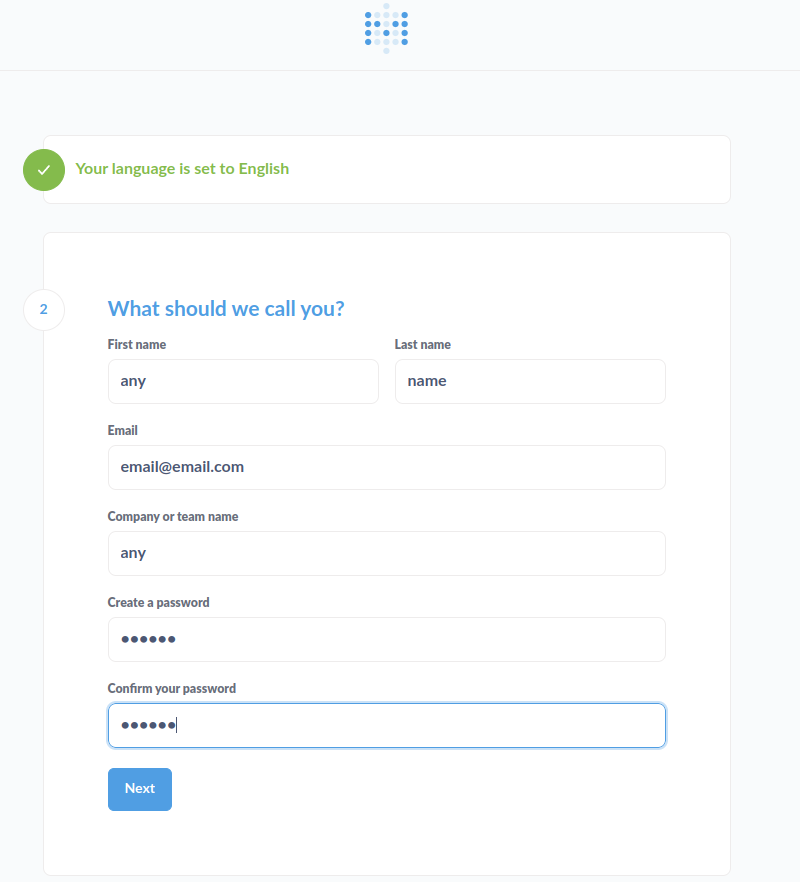
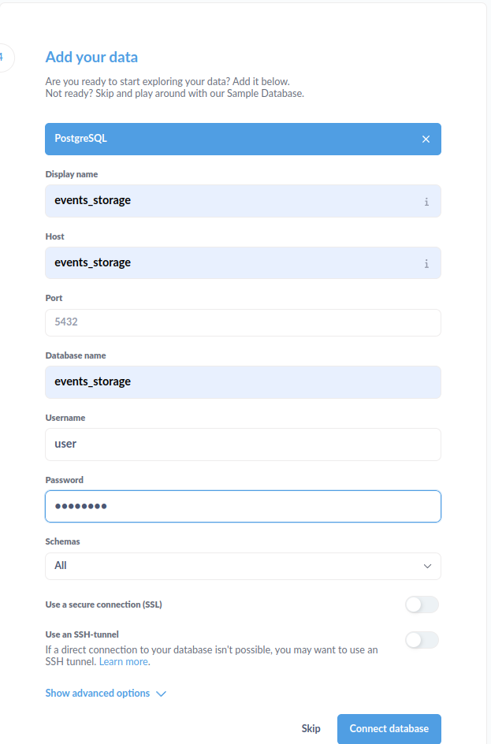
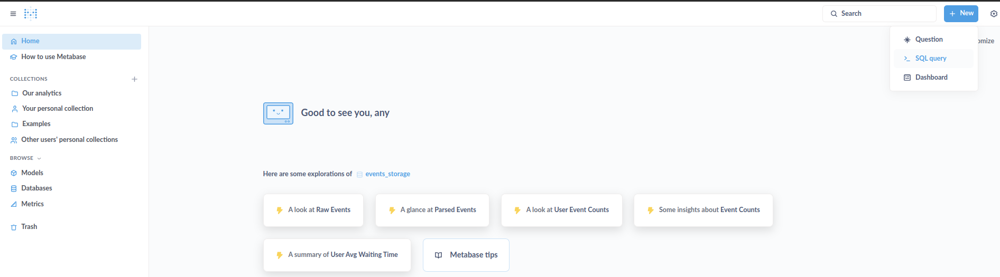

# Boas vindas ao **streaming_system**!

O objetivo deste projeto é simular um sistema de ingestão de eventos em tempo real, integrando o **Apache Kafka** como serviço de mensageria e o storage dos eventos com **PostgreSQL** através do **Apache Spark**.

> **IMPORTANTE: Todos os cenários consideram a execução do projeto à partir da raiz do projeto.
>  Logo após cloná-lo abra a pasta resultado em seu terminal:**
  >  ```bash
  >  cd streaming_system
  >  ```

# <a id='topicos'>Tópicos</a>
- [Decisões arquiteturais](#arch)
  - [Desenho do sistema](#design)
  - [Diagrama das entidades](#eer)
- [Executando projeto](#executing)
  - [Iniciando os serviços](#starting)
  - [Evoluindo o sistema](#evolving)
- [Visão dos sistemas](#display)
  - [Acompanhando geração de eventos](#lambda)
  - [Acessando mensageria](#kafka)
  - [Acessando banco de dados](#sql)
    - [Visualizando métricas](#metrics)
  - [Acompanhando ingestão](#ingestion)
- [Próximos passos](#next)

## <a id='arch'>[Decisões arquiteturais](#topicos)</a>

### <a id='design'>[Desenho do sistema](#topicos)</a>



São sete serviços executando em conjunto:

- **kafka-server**: Servidor **Apache Kafka** que armazena o tópico **app-events**.
- **zookeeper**:  serviço que utiliza o **Apache Zookeeper** como gerenciador do servidor Kafka, permitindo a comunicação com seus recursos.
- **events_generator**: gerador de eventos aleatórios para o tópico **app-events** no **Apache Kafka** `a cada 5 segundos`.
  - baseado em **clean-architecture**
- **streaming_ingestion**: Serviço **Apache Spark** que consome os eventos do tópico **app-events**, com as soluções `streaming` do motor, e os armazena no banco de dados **events_storage** `a cada minuto`.
- **events_storage**: Servidor de banco de dados **PostgreSQL** que armazena os eventos recebidos, representando um **[datalake](#eer)**
- **metabase**: Solução opensource de Business Inteligence, escolhida como **serving layer**, para consultas `SQL` ao storage, e construção de visualizações dos seus dados
- **nginx**: Servidor web opensource, atualmente usado como índice dos serviços de `Spark UI` e do `Metabase`

### <a id='eer'>[Diagrama das entidades](#topicos)</a>

Baseado em **um sistema Kappa e o modelo medalhão (multi-hop)**, os artefatos de dados gerados são:



- **raw_events**: buscando preservar a linhagem dos dados, persiste os dados brutos dos eventos do tópico consumidos;
- **parsed_events**: servindo os dados acurados da camada anterior, permite a exploração do conteúdo dos eventos do tópico;
- **event_counts**: tabela que agrega a contagem de eventos por tipo, na janela de tempo da ingestão.
- **user_event_counts**: tabela que agrega a contagem de eventos por usuário, na janela de tempo da ingestão.
- **user_avg_waiting_time**: tabela que agrega o tempo médio de espera dos últimos 3 minutos por usuário, na janela de tempo da ingestão.

## <a id='executing'>[Executando projeto](#topicos)</a>

### <a id='starting'>[Iniciando os serviços](#topicos)</a>

Na raiz do projeto, execute o comandos abaixo para os recursos correspondentes `em um terminal shell`:

* **iniciando os serviços:**
```bash
docker-compose up -d # requisito para os recursos abaixo
```

### <a id='evolving'>[Evoluindo o sistema](#topicos)</a>

Para manutenção e evolução do sistema, os seguintes comandos podem ser úteis:

* **removendo todos os recursos do sistema:**
```bash
docker-compose down --rmi all --volumes --remove-orphans
docker system prune -a --volumes -f
```

* **validando remoção:**
```bash
docker ps -a  # Verifica se ainda há containers parados
docker images  # Verifica se ainda há imagens
docker volume ls  # Verifica se ainda há volumes
```

* **removendo individualmente se necessário:**
```bash
docker rm -f $(docker ps -aq)  # Remove todos os containers
docker rmi -f $(docker images -q)  # Remove todas as imagens
docker volume rm $(docker volume ls -q)  # Remove todos os volumes
```

* **reconstruindo aplicação forçando pull das imagens:**
```bash
docker-compose build --no-cache
# na sequência, inicie os serviços
docker-compose up -d
```

```bash
# ou de somente um container (que não seja dependência para outro):
docker-compose build streaming_ingestion
docker-compose up -d streaming_ingestion
```

* **acompanhando logs de um servico em específico:**
```bash
docker-compose logs -f events_generator
```

## <a id='display'>[Visão dos sistemas](#topicos)</a>

### <a id='lambda'>[Acompanhando geração de eventos](#topicos)</a>

* **acompanhando logs do events_generator:**
```bash
docker logs -f events_generator
```

### <a id='kafka'>[Acessando mensageria](#topicos)</a>

* **confirmando criação do tópico Kafka:**
```bash
docker exec -it kafka-server kafka-topics --list --bootstrap-server kafka-server:9092
```

* **detalhes do tópico:**
```bash
docker exec -it kafka-server kafka-topics --describe --topic app-events --bootstrap-server kafka-server:9092
```

* **consumindo mensagens do tópico:**
```bash
docker exec -it kafka-server kafka-console-consumer --topic app-events --from-beginning --bootstrap-server kafka-server:9092
```

### <a id='sql'>[Acessando banco de dados](#topicos)</a>

* **acessando o container do banco:**
```bash
docker exec -it events_storage bash
```

* **dentro do container, acessando o banco:**
```bash
psql -U user -d events_storage
```

* **listando tabelas:**
```bash
\dt
```

* **consumindo tabelas: (SQL padrão)**
```sql
SELECT * FROM event_counts;
```

* **limpando tela do console**
```bash
Ctrl + L
```

```bash
# ou
\! clear
```

* **sair do banco:**
```bash
\q
```

* **ou sair do container:**
```bash
exit
```

### <a id='metrics'>[Visualizando métricas](#topicos)</a>

* **Contagem de eventos por tipo (Tabela event_counts):**
```sql
-- Mostra a contagem total de eventos por tipo
SELECT
  event_type,
  SUM(occurrences) AS total_events
FROM
  event_counts
GROUP BY
  event_type
ORDER BY
  total_events DESC;
```

* **Contagem de eventos por usuário (Tabela user_event_counts):**
```sql
-- Mostra a quantidade de eventos recebidos por cada usuário
SELECT
  user_id,
  SUM(occurrences) AS total_events
FROM
  user_event_counts
GROUP BY
  user_id
ORDER BY
  total_events DESC;
```

```sql
-- Mostra a distribuição dos eventos por tipo e por usuário
SELECT
  user_id,
  event_type,
  SUM(occurrences) AS total_by_type
FROM
  user_event_counts
GROUP BY
  user_id, event_type
ORDER BY
  user_id, total_by_type DESC;
```

* **Tempo médio de espera por usuário (Tabela user_avg_waiting_time):**
```sql
-- Mostra o tempo médio de espera atual por usuário (em segundos)
SELECT
  user_id,
  ROUND(AVG(avg_waiting_time)::numeric, 2) AS mean_waiting_time_seconds
FROM
  user_avg_waiting_time
GROUP BY
  user_id
ORDER BY
  mean_waiting_time_seconds DESC;

-- Mostra os usuários com maior tempo médio de espera registrado
SELECT
  user_id,
  MAX(avg_waiting_time) AS max_waiting_time_seconds
FROM
  user_avg_waiting_time
GROUP BY
  user_id
ORDER BY
  max_waiting_time_seconds DESC
LIMIT 10;
```

### <a id='ingestion'>[Acompanhando ingestão](#topicos)</a>

* **acompanhando logs do Spark Streaming:**
```bash
docker logs -f streaming_ingestion
```

* **acessando Spark UI:**
  * [http://localhost:4040](http://localhost:4040)
  
### <a id='next'>[Próximos passos](#topicos)</a>
* Adicionar camada de serving dos dados: 
  * Com solução de visualização (como streamlit)
  * Com interface ao banco de dados (como pgadmin)
* Tuning do streaming_ingestion:
  * Via Spark confs;
  * Com refatoração do código-fonte;
  * Integração com logs e configs do events_generator pensando em boas práticas
* Prover integração contínua:
  * Provisionar a aplicação
  * Com esteira CI/CD
  * Com orquestração dos containers via Kubernetes

### <a id='graph_ui'>[Camada de serviços](#topicos)</a>

* **acessando Índice de Serviços:**
  * [http://localhost:8080](http://localhost:8080)

* **acessando Metabase diretamente:**
  * [http://localhost:3000](http://localhost:3000)

  * faça um cadastro com quaisquer valores
    * email com qualquer domínio que use `@`
    * senha com no mínimo 6 caracteres

    

  * conecte com o storage (no setup ou depois)
    * Selecione o conector `PostgreSQL`
    * Em `Display name` informe qualquer valor;
    * Em `Port` mantenha/insira **5432**;
    * Em `Host` e `Database name`, insira `events_storage`;
    * Em `Username` insira **user**;
    * Em `Password` insira **password**.

    
  
  * clique no botão `New` para interagir com o sevidor Postgres, ou use algumas das sugestões da tela inicial

    
